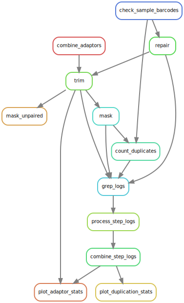

# tcdemux

Demultiplex files and prepare reads for target capture pipeline.

1. Either:
    a. Check external barcodes, then demux by internal barcode, or
    b. Check external barcodes only
3. Verify pairing
4. Trim adaptors
5. Mask low-complexity regions

### With internal barcodes

**The numbered (anonymous) rules are cutadapt demultiplexing runs**.


### With only external barcodes



## Configuration

Ingest a csv with mandatory fields `name`, `i5_index`, `i7_index`, `r1_file`, `r2_file`.

If the csv also has the `pool_name` field, demuxing by internal index sequence will happen. This also requires the `internal_index_sequence` field.

## Overview

### 1. Strict check on original files for reads with barcode mismatches.

You can see if this was allowed in the cassava pipeline e.g. as follows:

```bash
grep '^@' /path/to/file.fastq \
	| head -n 1000 \
	| cut -d':' -f10 \
	| sort \
	| uniq -c
```

Remove these e.g. with `demuxbyname.sh`.

```bash
demuxbyname.sh in=<file> out=<outfile> delimiter=: prefixmode=f
This will split on colons, and use the last substring as the name; useful for
demuxing by barcode for Illumina headers in this format:
@A00178:73:HH7H3DSXX:4:1101:13666:1047 1:N:0:ACGTTGGT+TGACGCAT

# and

names=          List of strings (or files containing strings) to parse from read names.
                If the names are in text files, there should be one name per line.
                This is optional.  If a list of names is provided, files will only be created for those names.
                For example, 'prefixmode=t length=5' would create a file for every unique last 5 characters in read names,
                and every read would be written to one of those files.  But if there was addionally 'names=ABCDE,FGHIJ' 
                then at most 2 files would be created, and anything not matching those names would go to outu.


```

You have to check how the external barcodes have been represented in the metadata. For example, in one set of metadata where the i5 index is listed as AGCGCTAG and the i7 index is listed as CCGCGGTT, the reads show up with headers like this:

```
    983 CCGCGGTT+CTAGCGCT
```

In this case, you would select the correct reads with names='CCGCGGTT+CTAGCGCT'. Check if the plus needs to be escaped.

### 2. Strict check for internal barcodes using cutadapt

I think the most straightforward way to do this is using cutadapt's [paired adaptor demultiplex mode](https://cutadapt.readthedocs.io/en/stable/guide.html#unique-dual-indices) (so that both reads are checked).

Alternatively, you could use cutadapt's [regular demultiplexing mode](https://cutadapt.readthedocs.io/en/stable/guide.html#demultiplexing), although this would only check the first read:

> Paired-end demultiplexing always uses the adapter matches of the first read to decide where a read should be written. If adapters for read 2 are given (-A/-G), they are detected and removed as normal, but these matches do not influence where the read pair is written
