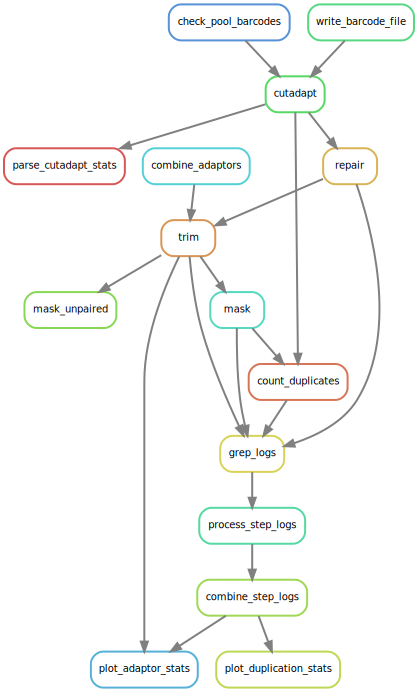

# tcdemux

Demultiplex files and prepare reads for target capture pipeline.

1. Either:
   a. Check external barcodes, then demux by internal barcode, or
   b. Check external barcodes only
3. Verify pairing
4. Trim adaptors
5. Mask low-complexity regions

## Installation

Use the container hosted at [ghcr.io/tomharrop/tcdemux](https://ghcr.io/tomharrop/tcdemux) with Docker or Apptainer/Singularity, *e.g.*:

```bash
apptainer exec \
    docker://ghcr.io/tomharrop/tcdemux:0.0.5 \
    tcdemux
```

## Manual installation

Manual installation is not supported, but if you need to do it, you can follow these steps:

1. install `bbmap` and make sure it's in your path
2. install `tcdemux` with `python3 -m pip install git+git://github.com/tomharrop/tcdemux.git`

## Usage

### External barcodes only

`tcdemux` requires a csv file with the fields `name`, `i5_index`, `i7_index`, `r1_file`, and `r2_file`.

Provide the csv to `tcdemux` using the `--sample_data` argument.

Here's an example:

```csv
i5_index,i7_index,name,r1_file,r2_file
AGCGCTAG,CCGCGGTT,sample1,sample1_r1.fastq,sample1_r2.fastq
GAACATAC,GCTTGTCA,sample2,sample2_r1.fastq,sample2_r2.fastq
```

This will cause the `sample1` and `sample2` r1 and r2 files to be processed separately, resulting in output files called `sample1_r1.fastq.gz`, `sample1_r2.fastq.gz` and `sample1.unpaired.fastq.gz`, and the same for sample2.

`tcdemux` does not need to demultiplex the samples in this case.
The external barcodes are checked for errors before trimming and masking.
Checking barcodes is necessary because barcode errors are sometimes allowed in the Illumina workflow.
You can check if your fastq files have barcode errors as follows:

```bash
grep '^@' /path/to/file.fastq \
    | head -n 1000 \
    | cut -d':' -f10 \
    | sort \
    | uniq -c
```

**`tcdemux` does not allow barcode errors.**

### Additional, internal barcodes

If the csv also has a `pool_name` field, `tcdemux` will demultiplex the pools by internal index sequence.
This also requires `internal_index_sequence` field in the csv.

Here's an example:

```csv
pool_name,i5_index,i7_index,name,internal_index_sequence,r1_file,r2_file
pool1,AGCGCTAG,CCGCGGTT,sample1,GTGACATC,pool_r1.fastq,pool_r2.fastq
pool1,AGCGCTAG,CCGCGGTT,sample2,ACTGGCTA,pool_r1.fastq,pool_r2.fastq
```

In this case, sample1 and sample2 are multiplexed in pool1 with internal barcodes.
`tcdemux` will demultiplex the pool before trimming and masking, resulting in the same files as above.

### Other options

You also need to provide paths to the raw read directory and an output directory, and at least one adaptor file for trimming.

If you want to keep the intermediate files, pass the `--keep_intermediate_files` argument.

###  

```bash
usage: tcdemux [-h] [-n] [--threads int] [--mem_gb int] [--restart_times RESTART_TIMES]
               --sample_data SAMPLE_DATA_FILE --read_directory READ_DIRECTORY --adaptors
               ADAPTOR_FILES [ADAPTOR_FILES ...] --outdir OUTDIR
               [--keep_intermediate_files | --no-keep_intermediate_files]

options:
  -h, --help            show this help message and exit
  -n                    Dry run
  --threads int         Number of threads.
  --mem_gb int          Amount of RAM in GB.
  --restart_times RESTART_TIMES
                        number of times to restart failing jobs (default 0)
  --sample_data SAMPLE_DATA_FILE
                        Sample csv (see README)
  --read_directory READ_DIRECTORY
                        Directory containing the read files
  --adaptors ADAPTOR_FILES [ADAPTOR_FILES ...]
                        FASTA file(s) of adaptors. Multiple adaptor files can be used.
  --outdir OUTDIR       Output directory
  --keep_intermediate_files, --no-keep_intermediate_files
```

## Overview

### With internal barcodes

**The numbered (anonymous) rules are cutadapt demultiplexing runs**.



### With only external barcodes


